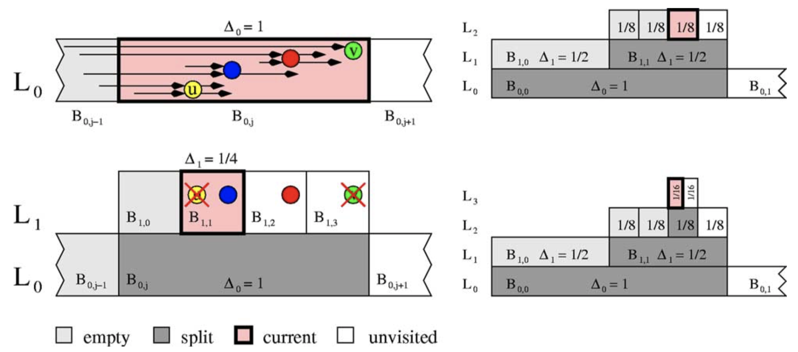
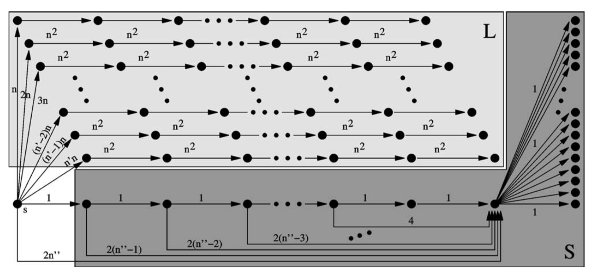
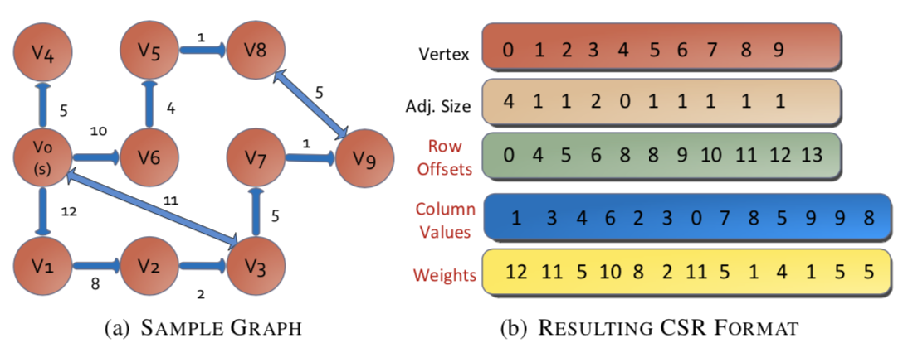

# Report: Single Source Shortest Path Problem

Email: wongck@pku.edu.cn

## Abstract

This report presents a study on the implementation for Single Source Shortest Path (SSSP) problem. In particular, we solve this problem on USA road maps data which is a part of tasks in the 9th DIMACS Challenge. We first introduce the problem and the dataset we used, and then analyze some traditional algorithms as well as their improvement. We also implements Dijkstra and ∆-stepping in serial and parallel version, respectively.

## 1 Introduction

The target of SSSP problem is to find the shortest paths from a source vertex to all other vertices in a graph $G=<V, E>$. The graph here on which we test our implementation is road map. In each test, our program need to input the graph and complete initialization first. After that, the program solves the problem and print the answer for each specified source vertex one by one.

In general, road maps could be seen as undirected connected graphs and is usually sparse graphs where the maximum node degree is not much larger that the average node degree. In the dataset we used, the average node degree is approximately 3~4. More importantly, all the edge weights is positive. Utilization of this property leads to faster algorithms.

## 2 SSSP algorithm

The basic idea behind the shortest path algorithms is quite straightforward. We maintain a value $\text{tent}(v)$ for each vertex $v$ representing the tentative distance for $v$, and follow some strategies to update $\text{tent}(v)$ until all vertices get their minimum value. Often, for an edge $(v,w)$, we may try to update $\text{tent}(w)$ by $\text{tent}(v) + c(v, w)$. We call such a procedure relaxation. Based on the approach used to perform relaxation,  shortest path algorithms could be divided into two types, i.e. label setting and label correcting. A label setting algorithm assigns a permanent value $\text{tent}(v)$ to a vertex $v$, while a correcting algorithm quite likely updates $\text{tent}(v)$ multiple times. Conform to this definition, traditional Dijkstra's algorithm is classified as label setting algorithm, while Bellman-Ford algorithm as well as the Shortest Path Faster Algorithm (SPFA) is classified as label correcting algorithm.

## 3 Serial Algorithm

### 3.1 Dijkstra

Dijkstra’s algorithm is probably the most efficient sequential algorithm. The main idea behind it is quite simple. The algorithm maintains two sets $D$ and $U$. At the beginning, let $U=V$, and set $\text{tent}(v)=+\infin$ for all $v$ except the source vertex. The algorithm proceeds in several phases. In each phase, pick the nearest vertex $v$ in $U$, move it from $U$ to $D$, and relax nodes adjacent to $v$.

Finding the nearest vertex is time consuming. In subsection 3.2, 3.3, we present some approaches to reduce the computational complexity.

### 3.2 Priority Queue

A straightforward idea is to resort to typical priority queue. This yields an algorithm running in $O(n \log n + m)$, where $n=|V|, m=|E|$. Priority queues can be implemented with balanced binary search tree, heap, etc. However, priority queue doesn't perform well in large graph. We can do better than $O(\log n)$.

### 3.3 Buckets

Inspired by bucket sorting, we can view every $\text{tent}(v)$ as an element to be sorted. Bucket $i$ stores $\text{tent}$ whose value ranges from $i\delta$ to $(i+1)\delta$. Here $\delta$ is a heuristic parameter. We maintained each bucket with priority queue and scanned the buckets in order, so that the nearest vertex could be obtained easily. Only $\text{tent}(v)$ whose vertex is in set $U$ is put into buckets. After relaxation, the new $\text{tent}(v)$ value is put into the corresponding bucket.

At first glance, it seems that we need $M/\delta$ buckets, where $M$ is the distance to the farthest vertex. Note that if we try to update $\text{tent}(w)$ by $\text{tent}(v) + c(v, w)$, the bucket id of $\text{tent}(w)$ will not be larger than the bucket id of $\text{tent}(v)$ plus $c(v, w) / \delta$. Therefore, we can use the buckets in circular way and we only need $L/\delta$ buckets ($L$ is the maximum edge length).

In our implementation, $\delta=16$ yields best performance. We also take advantage of bitwise operations to avoid division.

Can we go further than that? Sure. In this paper[4], researchers develop a new approach, which adaptively splits buckets. Amazingly, their method is the first that provably achieves linear $O(n + m)$ average-case execution time on arbitrary directed graphs. Its main idea is to extend the initial bucket structure by creating new levels ($L_1, L_2, L_3,\cdots$).



## 4  Parallel Algorithm

### 4.1 Parallelism Analysis 

Though Dijkstra works well if we are able to find the nearest vertex effectively, it exposes little parallelism between vertices. The only parallelism available is between edges leaving the vertex at the top of the queue. It is poorly suited for parallel architectures that require large numbers of parallel threads for efficient execution. 

To extract parallelism, we are required to assign computation to most of the processing units. We will soon see how to fulfill this in the following subsections.

### 4.2 ∆-Stepping

∆-stepping [3] extracts parallelism from traditional Dijkstra algorithm by grouping vertices into buckets and processes all vertices within a bucket simultaneously and in parallel. Vertices that lie in a specific distance range $\Delta$ share the same bucket. Edges are grouped into two categories: light and heavy. In each phase, we only consider the relaxation in a bucket until it become empty. Relaxation done by heavy edge must cause the new vertex lie outside another new bucket, so we don't need to worry about heavy edges until the end of a phase.

The performance of ∆-stepping crucially depends on the parameter $\Delta$. When $\Delta$ is too small, the algorithm behaves the same as traditional Dijkstra. When $\Delta$ is too large, the algorithm will exclusively use the first bucket, hence it leads to a parallel version of Bellman–Ford. Though for random graphs and realistic map graphs a good parameter is not hard to find, some graphs like the one shown below lead to $\Omega (n)$ phases for any given $\Delta$.



### 4.3 Dijkstra Strip Mined Relaxation

Dijkstra Strip Mined Relaxation (DSMR) [2] is an efficient parallel SSSP algorithm for shared and distributed-memory systems. It extracts parallelism by dividing the original graph into several subgraphs evenly. Each subgraph is assigned to a processing unit.

The method includes a number of supersteps. In every superstep, each processing unit asynchronously executes its local computation and the remote memory accesses are buffered locally. This continues until a global synchronization point is reached, and the buffers are exchanged. 

Local computation follows the algorithm in section 3, but stops when the number of relaxation exceeds a threshold $D$. It could be expected that $D/P$ remote relaxations be typically buffered ($P$ is the number of processing units).

## 5 Implementation Details

For serial version, we used Dijkstra algorithm along with buckets described in section 3.3 where $\delta=16$. For parallel version, we used ∆-stepping where $\Delta=256$.

### 5.1 Graph Data Structure

We select the Compressed Sparse Row (CSR) graph format to store the graphs. We appreciate space efficiency and good spatial locality, and this format meets our need well. For every vertex $v$, all the edges adjacent to $v$ are placed in a row. The resulting representation for the example graph is shown below.



### 5.2 Concurrent Queue

In order to achieve high performance when processors exchange data, we use a multi-producer and lock-free concurrent queue in ∆-stepping.

### 5.3 Bucket Structure

We use doubly-linked list to maintain the bucket elements.

We let the parameter be a power of 2 so that we can find the corresponding bucket for a given vertex by bitwise operation:

```c++
int buffer_mask = buffer_size - 1; // |buffer_size| is also a power of 2
int bucket_idx = (vertex->tent >> delta_log) & buffer_mask;
```

### 5.4 Work Partitioning

In our implementation,  vertices are evenly assigned to processors. For example, if there are $P$ processors, processor $i$ is responsible for the vertices whose indexes lie in $[i \cdot {n\over P}, (i+1)\cdot {n\over P})$. Each of the processor maintains its own concurrent queue and bucket structure, and stores there the queued relaxation requests and vertices it responsible for, respectively. Both OpenMP and MPI meet our need.

## Reference

[1] Work-Efficient Parallel GPU Methods for Single-Source Shortest Paths

[2] DSMR: A Parallel Algorithm for Single-Source Shortest Path Problem

[3] ∆-stepping: a parallelizable shortest path algorithm

[4] Average-case complexity of single-source shortest-paths algorithms: lower and upper bounds

[5] A Study of Different Parallel Implementations of Single Source Shortest Path Algorithms